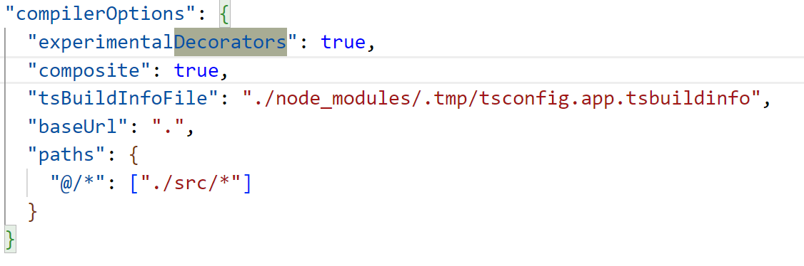

# 实验室管理系统

### 相关安装

- `npm install @vuelidate/core` @vuelidate/validators
- `npm i axios`
- `npm install vue-router --save`
  （timetable 页面）:

- npm install moment --save
- npm install element-plus --save
  其他 elementplus 配置根据:https://element-plus.org/zh-CN/guide/quickstart.html

（图表部分 graph）:

- npm install echarts --save

安装 vueuse 来代替 vuex/pinia 和 Axios
`npm i @vueuse/core`

安装 sass

- npm install node-sass --save-dev //安装 node-sass
- npm install sass-loader --save-dev //安装依赖包 sass-loader
- npm install style-loader --save-dev //安装 style-loader
- npm install -D sass-embedded
  (解决 sass 全局变量)
  由于 scss-loader 版本号过高会导致报错，可直接复制下面版本号至 package.json，然后 npm i 即可；
  "sass": "^1.32.8",
  "node-sass": "^5.0.0",
  "sass-loader": "^10.0.2"

### 问题解决

### update

**2024/1/1**

- 改进了计算当前时期是学期第几周的算法
- 使用装饰器实现缓存等

  - 在 tsconfig.app.json 中声明："experimentalDecorators": true,
    

- 使用加载
- 实现退出登录功能

  - **2024/12/31**

- 完成登陆注册
- 若账号密码一致，实现跳转改密码页面
- 若账号密码不一致，则根据账号角色跳转到相应页面
- **2024/12/30**

- 完成部分登陆注册
